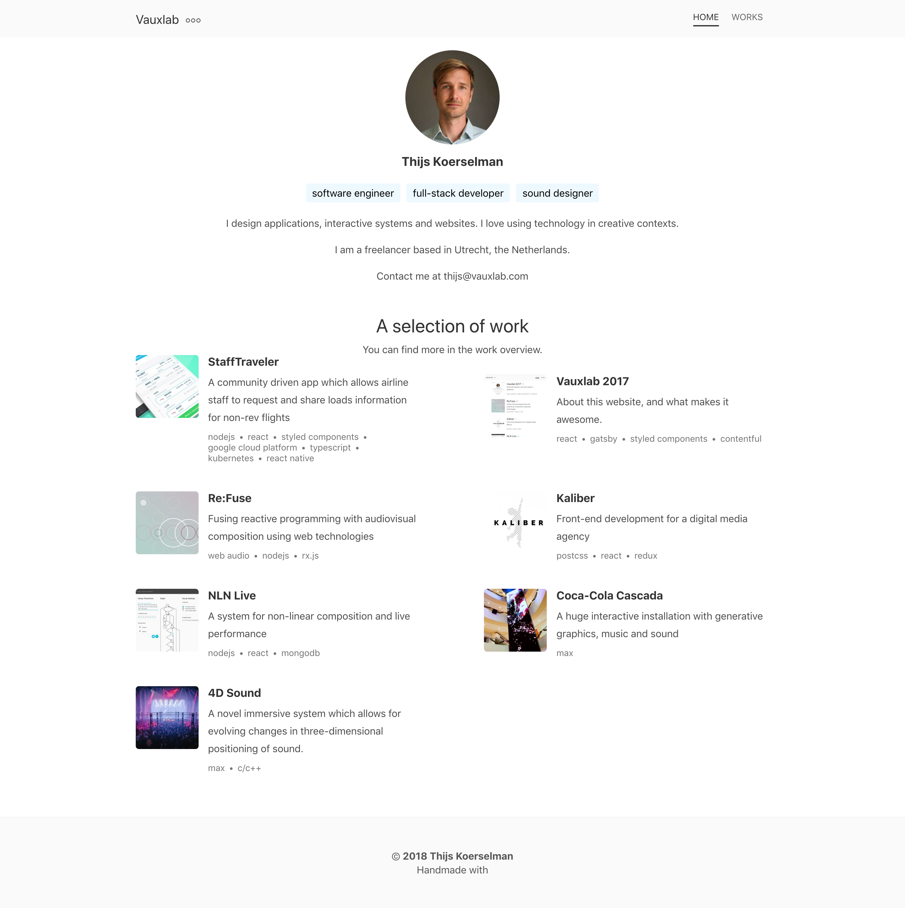

## selft-resume-website
用react开发的简单的个人简历网站。参考自[这个网站](https://www.vauxlab.com/)。


## 本地开发  
```js
npm start
```
## 打包构建
```
npm run build
```
打包后根目录下会出现一个`build`文件夹，这里面的代码就是你最终要部署的代码了。

把build文件夹上传到服务器部署即可。

或者使用`github pages`、`netlify`、`gitlab pages`免服务器免费部署。

## 视频课程  
如果想学习react，这里有一个完整的[视频课程](http://i.xue.taobao.com/detail.htm?spm=a2174.7365761.39b9.14.NpFkHf&courseId=105412)。